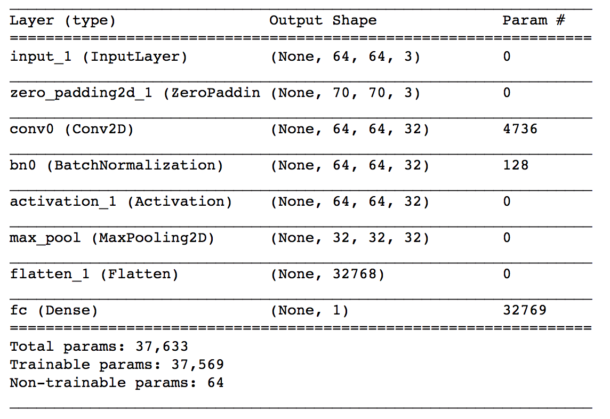
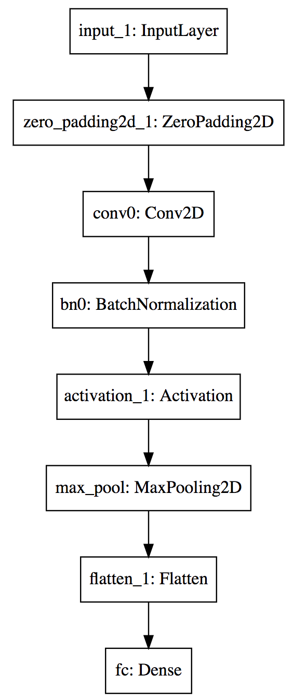

# Facial-Expression-Recognition
A Simple Keras- CNN implementation to recognize happy/unhappy faces

Face recognition problems commonly fall into two categories: 

- **Face Verification** - "is this the claimed person?". For example, at some airports, you can pass through customs by letting a system scan your passport and then verifying that you (the person carrying the passport) are the correct person. A mobile phone that unlocks using your face is also using face verification. This is a 1:1 matching problem. 
- **Face Recognition** - "who is this person?". For example, the video lecture showed a face recognition video (https://www.youtube.com/watch?v=wr4rx0Spihs) of Baidu employees entering the office without needing to otherwise identify themselves. This is a 1:K matching problem. 

FaceNet learns a neural network that encodes a face image into a vector of 128 numbers. By comparing two such vectors, this project determine if two pictures are of the same person.
    
## Aproach
- triplet loss function
- Use a pretrained model(ConvNet) to map face images into 128-dimensional encodings
- Use these encodings to perform face verification and face recognition

## Build a Neural Network
 

By using a 128-neuron fully connected layer as its last layer, the model ensures that the output is an encoding vector of size 128

## Reference
- [FaceNet: A Unified Embedding for Face Recognition and Clustering](https://arxiv.org/pdf/1503.03832.pdf)
- [DeepFace](https://arxiv.org/pdf/1804.06655.pdf) 
- [The pretrained model](https://github.com/iwantooxxoox/Keras-OpenFace)
- [FaceNet github repository](https://github.com/davidsandberg/facenet)
